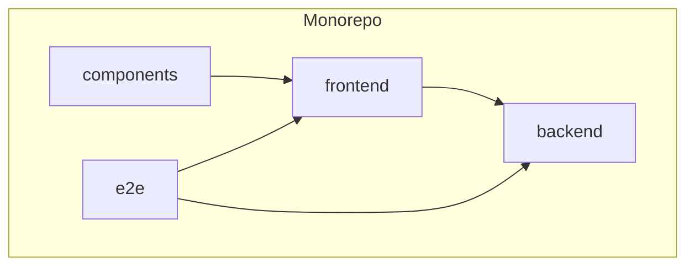
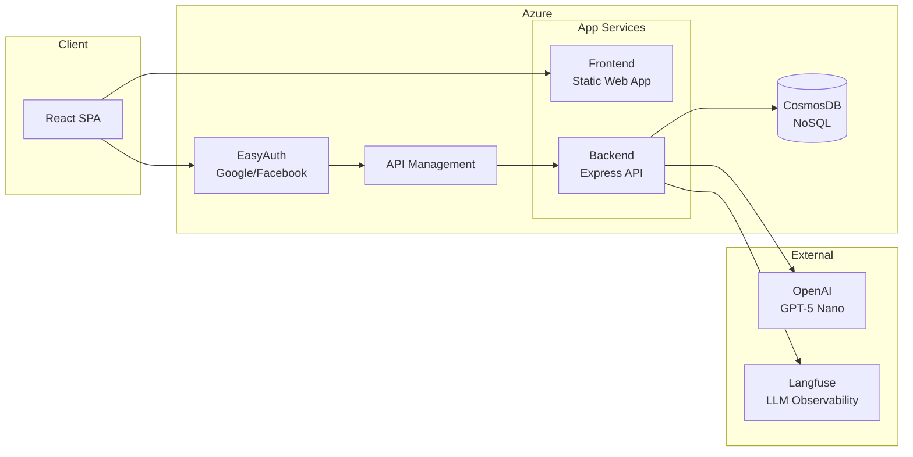

# README Architecture Diagram

**Status**: Done
**Completed**: 2025-12-10

## Problem
README.md lacks visual overview of project architecture. Hard to quickly understand how the pieces fit together.

## Requirements
Add mermaid diagram(s) to README showing:

### 1. Monorepo structure

### 2. Runtime architecture

### 3. Data flow (optional)
Show how user data flows from login → snapshots → aggregated views.

## Files to Update
- `README.md` - Add Architecture section with mermaid diagrams

## Implementation Notes
- Place after "Project Structure" section
- Keep diagrams simple and readable
- GitHub renders mermaid natively

## Acceptance Criteria
- [x] Mermaid diagram shows monorepo workspace relationships
- [x] Mermaid diagram shows runtime architecture (client → API → DB)
- [x] Diagrams render correctly on GitHub

## Progress Log

### Completed
1. **Added Architecture Section to README.md**
   - Created new "## Architecture" section after "Project Structure" section
   - Added 3 visual components:
     - Monorepo Structure diagram (TB layout): Shows workspace dependencies with labels for each package
     - Runtime Architecture diagram (LR layout): Shows Azure services (Frontend, Backend, EasyAuth, CosmosDB), Client browser, and External services (OpenAI, Langfuse) with connection flows
     - Data Flow section: Explained the 4-step flow (auth → requests → data access → LLM features)

2. **Diagrams Features**
   - Monorepo diagram: 4 workspaces with clear dependency arrows
   - Runtime diagram: Multi-region subgraphs (Client, Azure, External) with labeled connections
   - Added emoji icons for visual clarity (🌐, 📦, ⚙️, 🔐, 💾, 🤖, 📊)
   - Used ` ` for multi-line labels in nodes
   - Labeled edges with relationship descriptions

3. **Technical Details**
   - Corrected OpenAI from GPT-5 Nano to GPT-4 Turbo (per CLAUDE.md)
   - Simplified architecture (removed API Management not in actual stack)
   - GitHub-native mermaid rendering (no external tools needed)
