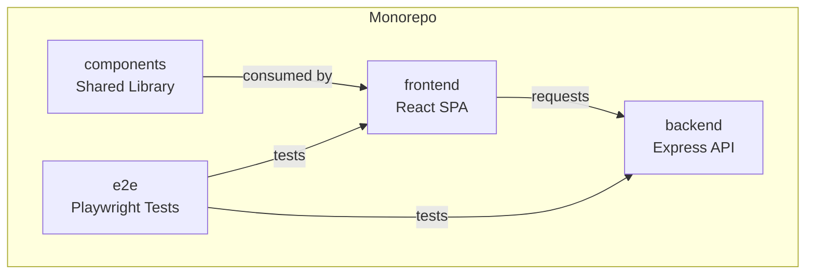
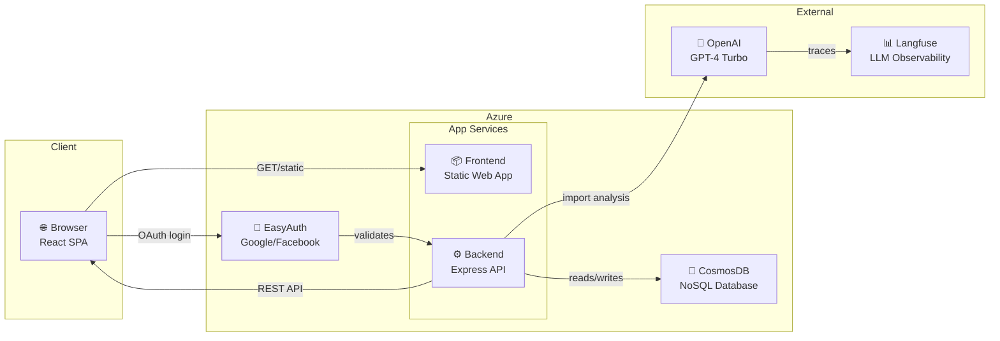

# Finans

Portfolio and wealth tracking application for monthly monitoring of investments and net worth.

## Prerequisites

- **Node.js**: 18.x or 20.x
- **pnpm**: 8.x or higher
- **Azure CosmosDB Emulator** (for local development)

## Installation

```bash
# Install pnpm if you don't have it
npm install -g pnpm

# Install dependencies
pnpm install
```

## Environment Setup

### Backend

Copy the example environment file and configure it:

```bash
cd backend
cp .env.example .env
```

The default values work for local development with the CosmosDB Emulator. For OAuth and OpenAI features, update the relevant keys in `.env`.

### Frontend

Copy the example environment file:

```bash
cd frontend
cp .env.example .env
```

The default values point to the local backend server.

## Starting the CosmosDB Emulator

Before running the backend, start the CosmosDB Emulator:

```bash
# Windows
.\emulator.bat
```

Or download and install the emulator from: https://aka.ms/cosmosdb-emulator

The emulator runs at `https://localhost:8081`.

## Running the Application

### All Workspaces (Recommended)

Start both frontend and backend in parallel:

```bash
pnpm dev
```

This runs:
- **Frontend**: http://localhost:5173
- **Backend**: http://localhost:3000

### Individual Workspaces

```bash
# Frontend only
pnpm --filter frontend dev

# Backend only
pnpm --filter backend dev

# Storybook (component library)
pnpm --filter components storybook
```

## Project Structure

```
/frontend          - React application (Vite + TypeScript)
/backend           - Express API server
/components        - Shared component library with Storybook
/e2e               - Playwright E2E tests
```

## Architecture

### Monorepo Structure

The project is organized as a pnpm workspace with four packages:



### Runtime Architecture

The application runs on Azure with EasyAuth for authentication and CosmosDB for data persistence:



### Data Flow

1. **Authentication**: User logs in via OAuth (Google/Facebook) through Azure EasyAuth
2. **API Requests**: Frontend makes REST API calls to backend with EasyAuth token
3. **Data Access**: Backend validates token, queries/updates CosmosDB
4. **LLM Features**: Import agent uses OpenAI to analyze portfolio data, with traces sent to Langfuse

## Available Scripts

| Command | Description |
|---------|-------------|
| `pnpm dev` | Run frontend and backend in parallel |
| `pnpm build` | Build all workspaces |
| `pnpm lint` | Lint all workspaces |
| `pnpm format` | Format code with Prettier |
| `pnpm test:e2e` | Run Playwright E2E tests |

## Tech Stack

- **Frontend**: React 18, TypeScript, Vite, BeerCSS, TanStack Query, Zustand
- **Backend**: Express, TypeScript, Azure CosmosDB
- **Components**: Storybook, BeerCSS, Material UI
- **Testing**: Playwright
